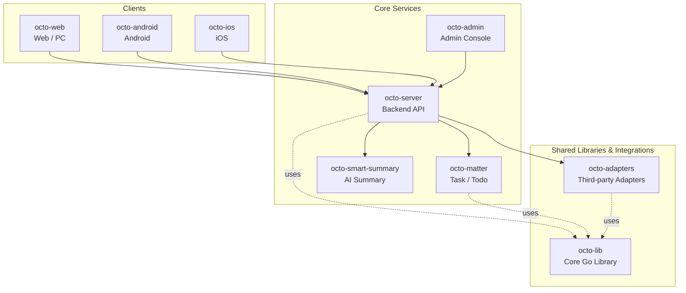

<p align="center">
  
  
</p>

<p align="center">
  <b>OCTO — the open workplace built for humans × AI agents.</b><br/>
  <sub>Let <b>Lobsters</b> (OpenClaw-powered digital doubles) do the <i>thinking</i> and <i>doing</i>. You focus on <i>taste</i>.</sub>
</p>

<p align="center">
  <a href="https://github.com/Mininglamp-OSS"><b>🏠 OCTO Home</b></a> ·
  <a href="#-quickstart"><b>🚀 Quickstart</b></a> ·
  <a href="#-octo-ecosystem"><b>📦 Ecosystem</b></a> ·
  <a href="./CONTRIBUTING.md"><b>🤝 Contributing</b></a>
</p>

<p align="center">
  <a href="./LICENSE"></a>
  <a href="./README.zh.md"></a>
</p>

---

> 🌐 **Read in**: **English** · [简体中文](README.zh.md)

# OCTO Lib

> The **Go foundation library** that every OCTO backend service builds on — protocol, crypto, storage, HTTP, logging, event bus.

`octo-lib` is the shared Go module at the bottom of the OCTO backend stack. It
contains the protocol types, cryptographic primitives, storage adapters, HTTP
helpers, worker pool, and event-bus code that `octo-server`, `octo-matter`, and
the adapters layer all import rather than re-implement.

## 🌟 Why OCTO Lib

- **One protocol surface.** All OCTO services speak the same message / channel / stream types — defined once, here. No silent drift between services.
- **Batteries included, dependencies minimal.** RSA / AES / DH / SHA crypto, SSRF-safe URL validation, MySQL / Redis / SQLite adapters, a zap-based structured logger, and a Webhook gRPC client are all a single `import` away.
- **Stable, versioned Go module.** Consumed as a regular `go get` dependency; SemVer-tagged; no vendoring required, no magic code generation at build time.

## 🚀 Quickstart

```bash
go get github.com/Mininglamp-OSS/octo-lib
```

Then in your Go code:

```go
import (
    "github.com/Mininglamp-OSS/octo-lib/pkg/log"
    "github.com/Mininglamp-OSS/octo-lib/pkg/util"
)

func main() {
    log.Info("hello octo")
    id := util.GenUUID()
    log.Info("new id: " + id)
}
```

See [`pkg/`](./pkg) for the full package catalogue.

## 📦 Modules / Architecture

Top-level packages in this module:

| Path | Purpose |
|---|---|
| `common/` | Cache, pagination, message types, constants |
| `config/` | App context, config loader, message / group / channel / stream / RTC configs, ES & tracer init |
| `model/` | Shared data models (channel, response) |
| `module/` | Module registration primitives |
| `server/` | HTTP server bootstrap |
| `testutil/` | Test helpers |
| `pkg/cache/` | In-memory cache |
| `pkg/db/` | MySQL / Redis / SQLite adapters |
| `pkg/keylock/` | Per-key lock |
| `pkg/log/` | Structured logger (zap-based) |
| `pkg/markdown/` | Markdown rendering |
| `pkg/network/` | HTTP client helpers |
| `pkg/pool/` | Worker pool / job dispatcher |
| `pkg/redis/` | Redis client helpers |
| `pkg/register/` | API & task router registration |
| `pkg/util/` | Crypto (AES / RSA / DH / SHA / MD5), base62, decimal, IP, SSRF-safe URL validation, reflection, time, UUID, string / json utils |
| `pkg/wait/` | Wait-group helpers |
| `pkg/wkevent/` | Event bus |
| `pkg/wkhook/` | Webhook gRPC service (proto + generated code) |
| `pkg/wkhttp/` | HTTP handler framework |
| `pkg/wkrsa/` | RSA utilities |

## 🔗 OCTO Ecosystem

<!-- shared snippet: OCTO repo matrix. Keep identical across all 9 repos. -->



| Repository | Language | Role |
|---|---|---|
| [`octo-server`](https://github.com/Mininglamp-OSS/octo-server) | Go | Backend API · business orchestration · Lobster agent scheduling |
| [`octo-matter`](https://github.com/Mininglamp-OSS/octo-matter) | Go | Task / Todo / Matter micro-service |
| [`octo-smart-summary`](https://github.com/Mininglamp-OSS/octo-smart-summary) | Go | LLM-powered conversation summarisation |
| [`octo-web`](https://github.com/Mininglamp-OSS/octo-web) | TypeScript / React | Web & PC (Electron) client |
| [`octo-android`](https://github.com/Mininglamp-OSS/octo-android) | Kotlin / Java | Native Android client |
| [`octo-ios`](https://github.com/Mininglamp-OSS/octo-ios) | Swift / Objective-C | Native iOS client |
| [`octo-admin`](https://github.com/Mininglamp-OSS/octo-admin) | TypeScript / React | Admin console (tenant / org / user / channel management) |
| [`octo-lib`](https://github.com/Mininglamp-OSS/octo-lib) | Go | Shared core library (protocol, crypto, storage, HTTP) |
| [`octo-adapters`](https://github.com/Mininglamp-OSS/octo-adapters) | TypeScript / Python | Third-party integrations (IM bridges, AI channels) |

## 🧭 Philosophy

OCTO ships under three shared principles that apply to every repository in this matrix:

1. **Local-first.** Anything that can run on the user's own box — chats, embeddings, agents — should. Your data stays yours; cloud is a choice, not a requirement.
2. **Humans judge, AI thinks and acts.** Humans focus on *taste* (what matters, what's right, what to ship). Lobster agents — OpenClaw-powered digital doubles — carry the *thinking* and *execution* load.
3. **Release-as-product.** Every open-source cut is shipped as a self-contained product, not a code dump: one squash per release, Apache 2.0, no internal baggage, reproducible from this repo alone.

## 🤝 Contributing

We love pull requests! Before you open one, please read:

- [CONTRIBUTING.md](CONTRIBUTING.md) — workflow, branch model, commit style
- [CODE_OF_CONDUCT.md](CODE_OF_CONDUCT.md) — community expectations

For security issues please follow [SECURITY.md](SECURITY.md) instead of the public tracker.

## 📄 License

Apache License 2.0 — see [LICENSE](LICENSE) for the full text and [NOTICE](NOTICE) for third-party attributions.

## 🙏 Acknowledgments

OCTO is built on the excellent work of the open-source community. We'd like to especially thank:

- **[TangSengDaoDaoServerLib](https://github.com/TangSengDaoDao/TangSengDaoDaoServerLib)** — our upstream project, by the TangSengDaoDao team.
- **[WuKongIM](https://github.com/WuKongIM/WuKongIM)** — the underlying real-time messaging core.

See [NOTICE](NOTICE) for the full attribution list and third-party Go module licenses.

---

<p align="center">
  <sub>Made with 🐙 by <b>OCTO Contributors</b> · <a href="https://github.com/Mininglamp-OSS">Mininglamp-OSS</a></sub>
</p>
