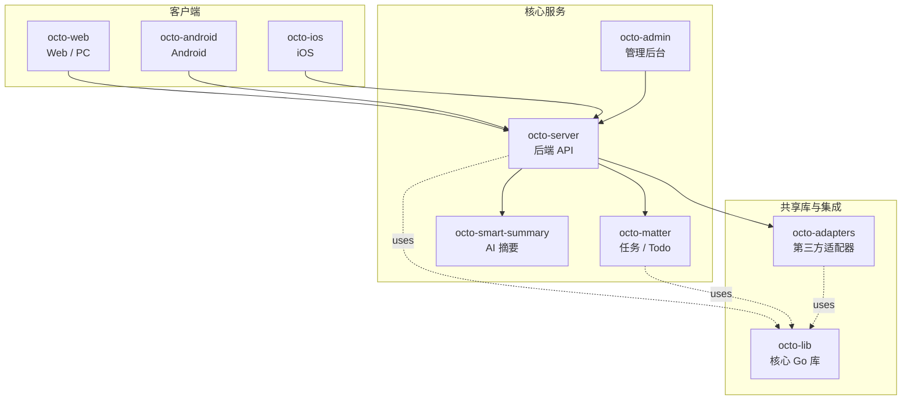

<p align="center">
  
  
</p>

<p align="center">
  <b>OCTO —— 为人和 AI Agent 协作而生的开源工作平台。</b><br/>
  <sub>让 <b>龙虾（Lobster / OpenClaw-powered digital double agents）</b>去「思」和「行」，让人专注于「品」。</sub>
</p>

<p align="center">
  <a href="https://github.com/Mininglamp-OSS"><b>🏠 OCTO 主页</b></a> ·
  <a href="#-快速开始"><b>🚀 快速开始</b></a> ·
  <a href="#-octo-生态"><b>📦 生态</b></a> ·
  <a href="./CONTRIBUTING.zh.md"><b>🤝 贡献</b></a>
</p>

<p align="center">
  <a href="./LICENSE"></a>
  <a href="./README.md"></a>
</p>

---

> 🌐 **语言**: [English](README.md) · **简体中文**

# OCTO Lib（简体中文）

> **Go 基础库** —— 所有 OCTO 后端服务的统一底座：协议、加解密、存储、HTTP、日志、事件总线。

`octo-lib` 是 OCTO 后端栈最底层的共享 Go 模块。它集中了协议类型、加密原语、
存储适配器、HTTP 辅助、工作池、事件总线等代码 —— `octo-server`、`octo-matter`、
adapters 层都直接 `import` 这个库，而不是各自重复实现一次。

## 🌟 为什么选 OCTO Lib

- **统一的协议面。** 所有 OCTO 服务共用同一套 message / channel / stream 类型 —— 只在这里定义一次，避免服务之间的隐性漂移。
- **内建完备，依赖精简。** RSA / AES / DH / SHA 加解密、SSRF 安全的 URL 校验、MySQL / Redis / SQLite 适配、基于 zap 的结构化日志、Webhook gRPC 客户端 —— 全部一次 `import` 即可使用。
- **稳定的版本化 Go module。** 以标准 `go get` 依赖方式使用；走 SemVer 打 tag；不需要 vendor，也不靠构建期魔法代码生成。

## 🚀 快速开始

```bash
go get github.com/Mininglamp-OSS/octo-lib
```

然后在你的 Go 代码里：

```go
import (
    "github.com/Mininglamp-OSS/octo-lib/pkg/log"
    "github.com/Mininglamp-OSS/octo-lib/pkg/util"
)

func main() {
    log.Info("hello octo")
    id := util.GenUUID()
    log.Info("new id: " + id)
}
```

完整的包目录见 [`pkg/`](./pkg)。

## 📦 模块与架构

本模块下的顶层包：

| 路径 | 功能 |
|---|---|
| `common/` | 缓存、分页、消息类型、常量 |
| `config/` | 应用上下文、配置加载、消息 / 群 / 频道 / 流 / RTC 配置、ES 与 Tracer 初始化 |
| `model/` | 共享数据模型（频道、响应） |
| `module/` | 模块注册原语 |
| `server/` | HTTP 服务启动 |
| `testutil/` | 测试工具 |
| `pkg/cache/` | 内存缓存 |
| `pkg/db/` | MySQL / Redis / SQLite 适配 |
| `pkg/keylock/` | 按 key 加锁 |
| `pkg/log/` | 结构化日志（基于 zap） |
| `pkg/markdown/` | Markdown 渲染 |
| `pkg/network/` | HTTP 客户端辅助 |
| `pkg/pool/` | 工作池与任务分发 |
| `pkg/redis/` | Redis 客户端辅助 |
| `pkg/register/` | API 与任务路由注册 |
| `pkg/util/` | 加解密（AES / RSA / DH / SHA / MD5）、base62、decimal、IP、SSRF 安全的 URL 校验、反射、时间、UUID、string / json 工具 |
| `pkg/wait/` | 等待组辅助 |
| `pkg/wkevent/` | 事件总线 |
| `pkg/wkhook/` | Webhook gRPC 服务（proto 与生成代码） |
| `pkg/wkhttp/` | HTTP 处理框架 |
| `pkg/wkrsa/` | RSA 工具 |

## 🔗 OCTO 生态

<!-- 共享片段：OCTO 仓库矩阵。9 个仓库之间保持一致。 -->



| 仓库 | 语言 | 职责 |
|---|---|---|
| [`octo-server`](https://github.com/Mininglamp-OSS/octo-server) | Go | 后端 API · 业务编排 · 龙虾 Agent 调度 |
| [`octo-matter`](https://github.com/Mininglamp-OSS/octo-matter) | Go | 任务 / Todo / Matter 微服务 |
| [`octo-smart-summary`](https://github.com/Mininglamp-OSS/octo-smart-summary) | Go | 基于 LLM 的会话摘要服务 |
| [`octo-web`](https://github.com/Mininglamp-OSS/octo-web) | TypeScript / React | Web 与 PC（Electron）客户端 |
| [`octo-android`](https://github.com/Mininglamp-OSS/octo-android) | Kotlin / Java | 原生 Android 客户端 |
| [`octo-ios`](https://github.com/Mininglamp-OSS/octo-ios) | Swift / Objective-C | 原生 iOS 客户端 |
| [`octo-admin`](https://github.com/Mininglamp-OSS/octo-admin) | TypeScript / React | 管理后台（租户 / 组织 / 用户 / 频道管理） |
| [`octo-lib`](https://github.com/Mininglamp-OSS/octo-lib) | Go | 共享核心库（协议 / 加密 / 存储 / HTTP） |
| [`octo-adapters`](https://github.com/Mininglamp-OSS/octo-adapters) | TypeScript / Python | 第三方集成（IM 桥接、AI 渠道） |

## 🧭 设计哲学

OCTO 遵循三条共用原则 —— 这套矩阵里的每个仓都一致：

1. **本地优先（Local-first）。** 能跑在用户本机的一切（对话、向量、智能体）都应尽量在本机完成。你的数据属于你；云是可选项，不是前置条件。
2. **人做「品」，AI 做「思」与「行」。** 人聚焦在品味（什么重要、什么对、该发什么）。龙虾（OpenClaw 驱动的数字分身）承担思考与执行。
3. **Release-as-product（每次发布即产品）。** 每一次开源切片都是一个自洽的产品，不是代码倾倒：一个 release 一次 squash，Apache 2.0，不夹带内部包袱，单仓即可复现。

## 🤝 贡献

欢迎提 Pull Request！开 PR 前请先读：

- [CONTRIBUTING.zh.md](CONTRIBUTING.zh.md) —— 工作流、分支模型、commit 规范
- [CODE_OF_CONDUCT.zh.md](CODE_OF_CONDUCT.zh.md) —— 社区行为准则

安全问题请按 [SECURITY.zh.md](SECURITY.zh.md) 上报，不要走公开 issue。

## 📄 许可

Apache License 2.0 —— 完整文本见 [LICENSE](LICENSE)，第三方致谢见 [NOTICE](NOTICE)。

## 🙏 致谢

OCTO 建立在开源社区的优秀工作之上，特别感谢：

- **[TangSengDaoDaoServerLib](https://github.com/TangSengDaoDao/TangSengDaoDaoServerLib)** —— 上游项目，由 TangSengDaoDao 团队开发。
- **[WuKongIM](https://github.com/WuKongIM/WuKongIM)** —— 底层实时消息内核。

完整的致谢与第三方 Go 模块清单见 [NOTICE](NOTICE)。

---

<p align="center">
  <sub>由 <b>OCTO Contributors</b> 🐙 共同开发 · <a href="https://github.com/Mininglamp-OSS">Mininglamp-OSS</a></sub>
</p>
